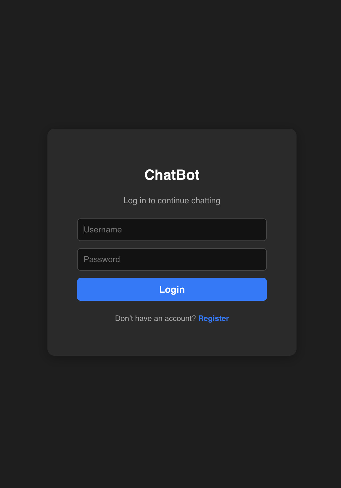
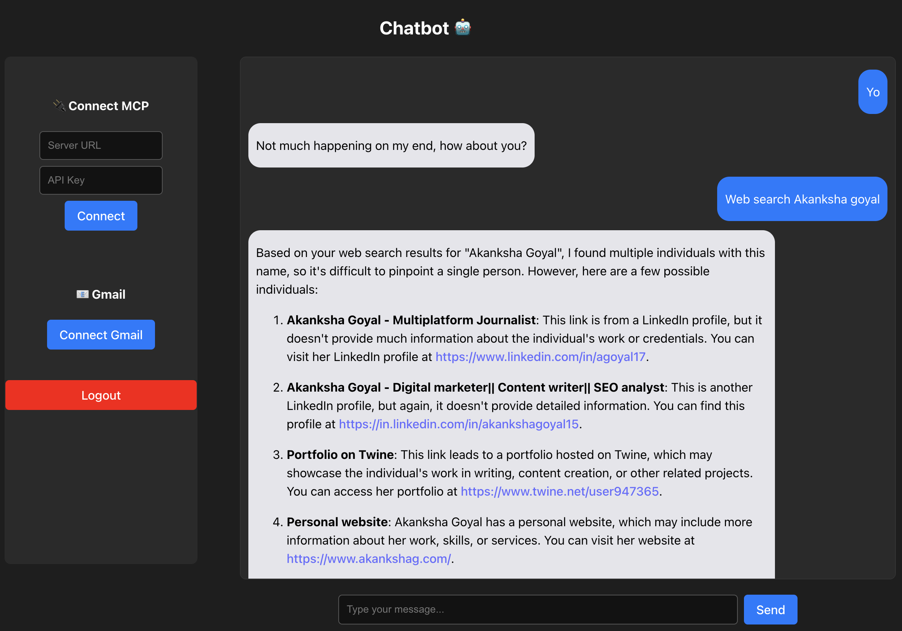
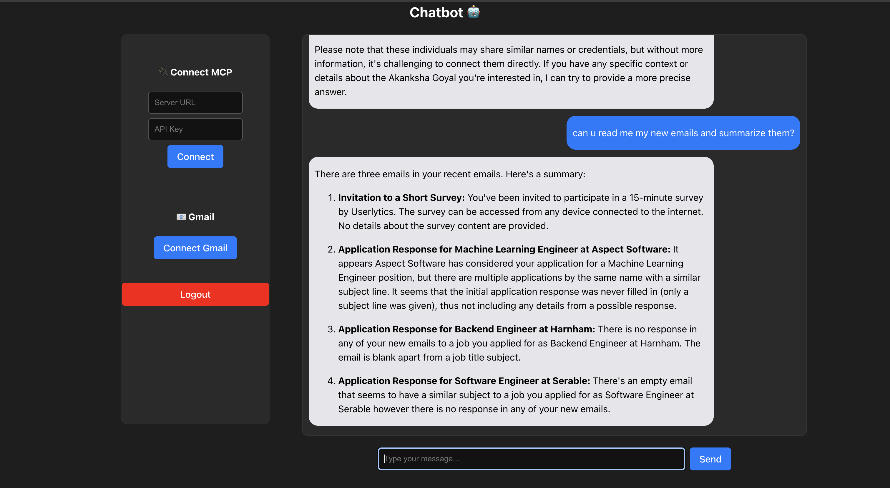
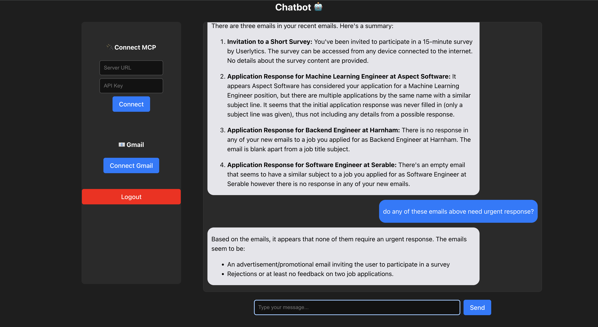

# 🤖 MCP Plug & Play Chatbot

<div align="center">

**An intelligent AI assistant that seamlessly integrates Gmail, Exa Search, and custom MCP servers**

Built with Cloudflare Workers · Supabase · React · Vercel

[](https://cloudflare-chatbot-six.vercel.app)
[](https://backend.dhairyalalwani.workers.dev)
[](LICENSE)

</div>

---

## ✨ Overview

This chatbot intelligently routes your queries to the right data source — **Gmail** for emails, **Exa** for live web information, or **Groq LLM** for contextual conversations. All powered by a serverless architecture for maximum performance and scalability.

### 🎯 Key Highlights

- 🧠 **Smart Routing** — Automatically detects intent and routes to the appropriate service
- 🔐 **Secure by Design** — JWT authentication with OAuth 2.0 for Gmail
- ⚡ **Blazing Fast** — Serverless edge deployment via Cloudflare Workers
- 💬 **Persistent Memory** — All conversations stored and synced across sessions
- 🎨 **Modern UI** — Clean, responsive React interface

---

## 🚀 Live Demo





| Service | URL |
|---------|-----|
| 🌐 **Frontend** | [cloudflare-chatbot-six.vercel.app](https://cloudflare-chatbot-six.vercel.app) |
| ⚙️ **Backend API** | [backend.dhairyalalwani.workers.dev](https://backend.dhairyalalwani.workers.dev) |

---

## 🎯 Features

<table>
<tr>
<td width="50%">

### 🤖 AI Chat
- Context-aware conversations
- Powered by Groq (Llama-3)
- Natural language understanding
- Multi-turn dialogue support

</td>
<td width="50%">

### 📧 Gmail Integration
- OAuth 2.0 secure authentication
- Fetch recent emails
- Smart email summarization
- Privacy-first design

</td>
</tr>
<tr>
<td width="50%">

### 🌐 Exa Web Search
- Real-time web data retrieval
- AI-powered search results
- Content summarization
- Source attribution

</td>
<td width="50%">

### 🔌 MCP Server Support
- Custom microservice integration
- API key authentication
- Flexible endpoint configuration
- Extensible architecture

</td>
</tr>
</table>

### Additional Features

- 🛡️ **Secure Authentication** — JWT-based user login & registration backed by Supabase
- 💾 **Persistent History** — All chat messages stored and synced across sessions
- 🎨 **Modern UI/UX** — Intuitive interface with real-time updates
- 📱 **Responsive Design** — Works seamlessly on desktop and mobile

---


### Tech Stack

| Layer | Technology         |
|-------|--------------------|
| **Frontend** | React, Vite, TailwindCSS |
| **Backend** | Cloudflare Workers |
| **Database** | Supabase (PostgreSQL) |
| **AI/ML** | Groq (Llama-3), Exa.ai |
| **Auth** | JWT, Google OAuth 2.0 |
| **Deployment** | Vercel, Cloudflare |

---

## ⚙️ Setup Instructions

### Prerequisites

- Node.js 18+ and npm
- Cloudflare account with Wrangler CLI
- Supabase account and project
- Google Cloud Console (for Gmail OAuth)
- Groq API key
- Exa API key

### 1️⃣ Clone the Repository

```bash
git clone https://github.com/dhairya1702/cloudflare-chatbot-final.git
cd cloudflare-chatbot-final
```

### 2️⃣ Backend Setup (Cloudflare Worker)

#### Install Dependencies

```bash
cd backend
npm install
```

#### Configure Secrets

Add your secrets using Wrangler CLI:

```bash
npx wrangler secret put SUPABASE_URL
npx wrangler secret put SUPABASE_SERVICE_ROLE_KEY
npx wrangler secret put GROQ_API_KEY
npx wrangler secret put EXA_API_KEY
npx wrangler secret put JWT_SECRET
npx wrangler secret put GOOGLE_CLIENT_ID
npx wrangler secret put GOOGLE_CLIENT_SECRET
```

> 💡 **Tip:** Generate a secure JWT secret using: `openssl rand -base64 32`

#### Deploy to Cloudflare

```bash
npx wrangler deploy
```

Your worker will be live at `https://your-worker.workers.dev`

### 3️⃣ Frontend Setup (React + Vercel)

#### Install Dependencies

```bash
cd frontend
npm install
```

#### Run Locally

```bash
npm run dev
```

Visit `http://localhost:5173` to test locally.

#### Environment Configuration

> ℹ️ **No `.env` file needed** — Frontend communicates directly with your deployed Cloudflare Worker at `https://backend.dhairyalalwani.workers.dev`

#### Deploy to Vercel

1. Push your code to GitHub
2. Connect your repository to Vercel
3. Vercel will automatically deploy on every push to `main`

---

## 🔐 OAuth Configuration (Gmail)

### Step-by-Step Setup

1. **Navigate to Google Cloud Console**
   - Go to [console.cloud.google.com](https://console.cloud.google.com/)
   - Select or create a project

2. **Enable Gmail API**
   - Navigate to **APIs & Services** → **Library**
   - Search for "Gmail API" and enable it

3. **Create OAuth 2.0 Credentials**
   - Go to **APIs & Services** → **Credentials**
   - Click **Create Credentials** → **OAuth 2.0 Client ID**
   - Choose **Web Application**

4. **Configure Redirect URIs**
   
   Add these authorized redirect URIs:
   ```
   https://cloudflare-chatbot-six.vercel.app/auth/callback
   http://localhost:5173/auth/callback
   ```

5. **Save Credentials**
   - Copy the **Client ID** and **Client Secret**
   - Add them to your Cloudflare Worker secrets (see Backend Setup)

---

## 💬 Usage Guide

### 🧩 Step 1: Login

1. Navigate to [cloudflare-chatbot-six.vercel.app](https://cloudflare-chatbot-six.vercel.app)
2. Click **Sign Up** to create a new account or **Login** if you already have one
3. Enter your credentials and authenticate

### 🤖 Step 2: Start Chatting

The bot intelligently routes your queries:

| Query Type | Routing | Example |
|------------|---------|---------|
| 📧 **Email** | Gmail API | *"Check my latest emails"* |
| 🔍 **Search** | Exa API | *"Search for AI news"* |
| 💬 **General** | Groq LLM | *"Explain quantum computing"* |

### 📧 Step 3: Connect Gmail

1. Click the **"Connect Gmail"** button in the sidebar
2. Authorize access through Google OAuth
3. You'll be redirected to `/auth/callback`
4. See confirmation: *"Gmail connection complete"*

> 🔒 **Privacy:** Your Gmail access token is encrypted and stored securely

### 🌐 Step 4: Use Exa Search

Try queries like:

```
"Search Exa for latest AI tools"
"Find articles about OpenAI"
"Show recent news about Apple and AI"
"What are the latest developments in quantum computing?"
```

The bot will fetch real-time web data and provide summarized results with sources.

### 🔌 Step 5: Connect MCP Server (Optional)

1. Click **"Settings"** → **"MCP Connections"**
2. Enter your MCP server details:
   - Server URL
   - API Key
   - Server Name (optional)
3. Click **"Connect"**
4. The bot will automatically use your MCP server when relevant

### 🚪 Step 6: Logout

- Click **Logout** in the sidebar
- Your session will be safely terminated
- All data remains securely stored for your next login

---

## 🗂️ Project Structure

```
cloudflare-chatbot-final/
├── backend/                    # Cloudflare Worker
│   ├── src/
│   │   ├── index.ts           # Main worker entry point
│   ├── wrangler.toml          # Cloudflare configuration
│   └── package.json
│
└── frontend/                   # React Application
    ├── src/
    │   ├── pages/            # Page components
    │   ├── utils/            # Utility functions
    │   └── App.tsx           # Main app component
    ├── package.json
    └── vite.config.ts        # Vite configuration
```

---

## 🔧 API Endpoints

### Authentication

| Endpoint | Method | Description |
|----------|--------|-------------|
| `/auth/register` | POST | Register new user |
| `/auth/login` | POST | Login user |
| `/auth/gmail` | GET | Initiate Gmail OAuth |
| `/auth/callback` | GET | Gmail OAuth callback |

### Chat & Messages

| Endpoint | Method | Description |
|----------|--------|-------------|
| `/chat` | POST | Send message and get AI response |
| `/messages` | GET | Retrieve chat history |
| `/messages/:id` | DELETE | Delete a message |

### Integrations

| Endpoint | Method | Description |
|----------|--------|-------------|
| `/mcp/connect` | POST | Connect MCP server |
| `/mcp/list` | GET | List connected MCP servers |
| `/mcp/disconnect/:id` | DELETE | Disconnect MCP server |

---

## 🚀 Deployment

### Cloudflare Worker

```bash
cd backend
npx wrangler deploy
```

Your worker will be deployed to `https://your-worker.workers.dev`

### Vercel Frontend

#### Option 1: GitHub Integration (Recommended)

1. Push to GitHub
2. Connect repository to Vercel
3. Auto-deploy on push to `main`

#### Option 2: Vercel CLI

```bash
cd frontend
npm install -g vercel
vercel --prod
```

---

## 🤝 Contributing

Contributions are welcome! Please follow these steps:

1. Fork the repository
2. Create a feature branch (`git checkout -b feature/amazing-feature`)
3. Commit your changes (`git commit -m 'Add amazing feature'`)
4. Push to the branch (`git push origin feature/amazing-feature`)
5. Open a Pull Request

---

## 📝 License

This project is licensed under the MIT License - see the [LICENSE](LICENSE) file for details.

---

## 🙏 Acknowledgments

- [Cloudflare Workers](https://workers.cloudflare.com/) for serverless deployment
- [Supabase](https://supabase.com/) for database and authentication
- [Groq](https://groq.com/) for lightning-fast LLM inference
- [Exa](https://exa.ai/) for AI-powered web search
- [Vercel](https://vercel.com/) for seamless frontend deployment

---

## 📧 Contact

**Dhairya Lalwani**

- GitHub: [@dhairya1702](https://github.com/dhairya1702)
- Project Link: [https://github.com/dhairya1702/cloudflare-chatbot-final](https://github.com/dhairya1702/cloudflare-chatbot-final)

---

<div align="center">

**⭐ Star this repo if you find it helpful!**

Made with ❤️ by Dhairya Lalwani

</div>